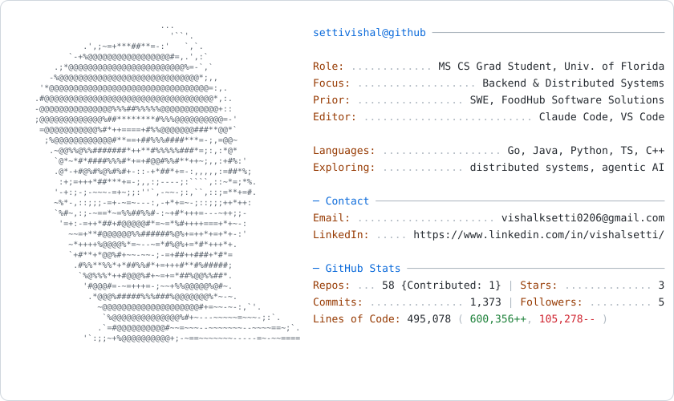

<picture>
  <source media="(prefers-color-scheme: dark)" srcset="dark_mode.svg">
  <source media="(prefers-color-scheme: light)" srcset="light_mode.svg">
  
</picture>

### Tech Stack

<!-- Optional: keep these two if you want them below the card — no code change needed,
     they're hosted services and update themselves. -->

<!-- 

 -->
